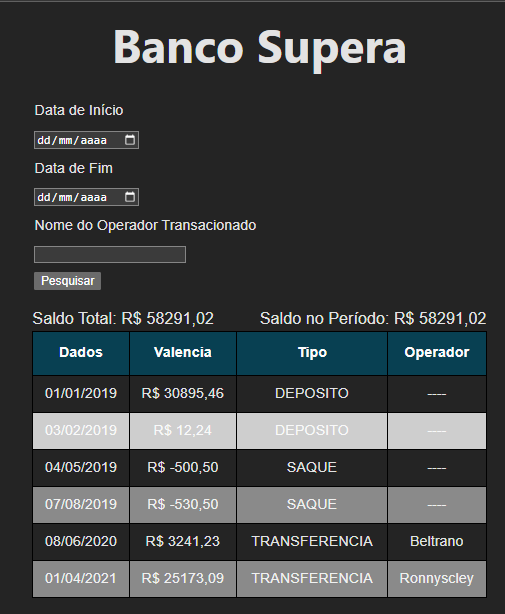

# BookstoreFront

## Descrição do Projeto

Projeto consiste na criação de intefaces web utilizando [REACT](https://react.dev/) para um sistema de visualização de transferencias bancárias, promovido pela empresa [Supera Inovação em Tecnologia](https://www.linkedin.com/company/supera-tecnologia/).

Para execução desse projeto precisasse consumir a api [banco-api](https://github.com/TaylanTorres09/api-banco) feita pelo autor desse mesmo projeto, por enquanto não foi feito deploy.

## Descrição
### Executar front-end localmente:
- Para clonar o projeto: git clone https://github.com/TaylanTorres09/banco-front.git
- Para Executar o projeto precisasse:
    - [NodeJS](https://nodejs.org/en/). Este projeto está usando a versão 18.12.1 ou superior.
    - [NPM](https://www.npmjs.com/). Versão 9.3.1
    - React executado com o [Vitejs](https://vitejs.dev/) para busca de uma melhor perfomance.
    - Como editor de código utilizei o [Visual Studio Code](https://code.visualstudio.com/).
    - Executar api [banco-api](https://github.com/TaylanTorres09/api-banco) localmente.
    - Por fim configurar o arquivo **.env** com o *endpoint* do back-end.

- Depois de instalados **EXECUTAR** comandos no seu terminal:
    - npm install.
    - npm run dev.
    - Após estes comandos o projeto será executado em um servido de desenvolvimento.
    - Poderá ser acessado na url: `http://localhost:5173/`.

#### Páginas - Clique na imagem e será redirecionado para vídeo.

## Próximos Passos
- Implementar Cobertura de testes.
- Fazer Deploy.
## Autor
 
